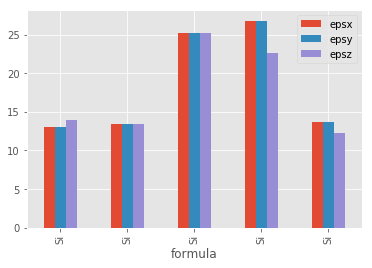
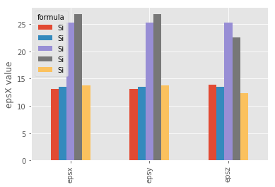
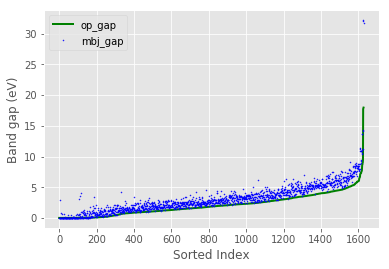

## [`matplotlib`](https://matplotlib.org/) is the most widely used scientific plotting library in Python.

*   Commonly use a sub-library called [`matplotlib.pyplot`](https://matplotlib.org/api/pyplot_api.html).
*   The Jupyter Notebook will render plots inline if we ask it to using a "magic" command.

~~~
%matplotlib inline
import matplotlib.pyplot as plt
~~~
{: .language-python}

*   Simple plots are then (fairly) simple to create.

~~~
time = [0, 1, 2, 3]
position = [0, 100, 200, 300]

plt.plot(time, position)
plt.xlabel('Time (hr)')
plt.ylabel('Position (km)')
~~~
{: .language-python}

## Plot data directly from a [`Pandas dataframe`](https://pandas.pydata.org/pandas-docs/stable/generated/pandas.DataFrame.html).

*   We can also plot [Pandas dataframes](https://pandas.pydata.org/pandas-docs/stable/generated/pandas.DataFrame.html).
*   This implicitly uses [`matplotlib.pyplot`](https://matplotlib.org/api/pyplot_api.html).
*   Before plotting, we convert the column headings from a `string` to `integer` data type, since they represent numerical values

~~~
%matplotlib inline
import matplotlib.pyplot as plt
import pandas

plt.style.use('ggplot')
data_all = pandas.read_csv('data/jarvis_all.csv', index_col='formula')
eps = data_all.loc['Si', 'epsx':'epsz']
eps.plot(kind="bar");
~~~
{: .language-python}

## Select and transform data, then plot it.

*   By default, [`DataFrame.plot`](https://pandas.pydata.org/pandas-docs/stable/generated/pandas.DataFrame.plot.html#pandas.DataFrame.plot) plots with the rows as the X axis.
*   We can transpose the data in order to plot multiple series.

~~~
eps.T.plot(kind="bar")
plt.ylabel('epsX value');
~~~
{: .language-python}

## Data can also be plotted by calling the `matplotlib` `plot` function directly.
*   The command is `plt.plot(x, y)`
*   The color / format of markers can also be specified as an optical argument: e.g. 'b-' is a blue line, 'g--' is a green dashed line.

## Get formation energy data from dataframe

~~~
form_emp = data_all.form_enp.sort_values()
plt.plot(form_emp.values, 'g--')
~~~
{: .language-python}

## Can plot many sets of data together.

~~~
data_sort = data_all.sort_values('op_gap')

plt.plot(data_sort.op_gap.values, 'g-', lw=2, label=r'op-gap')
plt.plot(data_sort.mbj_gap.values, 'b.', ms=1, label=r'mbj-gap')
plt.legend(loc='upper left')
plt.xlabel('Sorted Index')
plt.ylabel('Band gap (eV)');
~~~
{: .language-python}

*   Plot a scatter plot correlating the MBJ and OP band gap measurements.
*   Use either `plt.scatter` or `DataFrame.plot.scatter`

~~~
lim = [0, 15]
plt.scatter(data_all.mbj_gap, data_all.op_gap, s=1.5, c='g')
plt.xlim(lim)
plt.ylim(lim)
plt.plot(lim, lim, 'k--')
plt.axes().set_aspect('equal')
plt.xlabel('mbj (eV)')
plt.ylabel('op (eV)');
~~~
{: .language-python}

> ## Bandgap versus Bulk Modulus
>
> Make a scatter plot of the bandgap versus the bulk modulus (either
> `op_gap` or `mbj_gap` versus either `kv` or `gv`). Color the points
> based on whether the material is metal (bandgap < 0.05),
> semiconductor (0.05 < bandgap <= 3) or a insulator (bandgap >
> 3). Use `dataframe.plot` with the arguments `kind='scatter'`,
> `s=1.5` and `color=dataframe['color']`. Create an additional column
> in the dataframe for the color. The `s` argument controls the size
> of the points in the scatter plot. The `color` argument colors the
> points based on string values in a series or dataframe column
> (e.g. `r` for red or `g` for green).
>
> > ## Solution
> >
> > ~~~
> > df = pandas.read_csv('data/jarvis_all.csv')
> >
> > df.loc[:, 'color'] = 'r'
> > df.loc[df.op_gap < 3, 'color'] = 'g'
> > df.loc[df.op_gap < .05, 'color'] = 'b'
> >
> > df.plot('op_gap', 'epsx', kind='scatter', s=1.5, color=df['color'])
> > plt.xlim([-0.2, 6]);
> > ~~~
> > {: .language-python}
> > 
> {: .solution}
{: .challenge}

> ## Saving your plot to a file
>
> If you are satisfied with the plot you see you may want to save it to a file,
> perhaps to include it in a publication. There is a function in the
> matplotlib.pyplot module that accomplishes this:
> [savefig](https://matplotlib.org/api/_as_gen/matplotlib.pyplot.savefig.html).
> Calling this function, e.g. with
> ~~~
> plt.savefig('my_figure.png')
> ~~~
> {: .language-python}
>
> will save the current figure to the file `my_figure.png`. The file format
> will automatically be deduced from the file name extension (other formats
> are pdf, ps, eps and svg).
>
> Note that functions in `plt` refer to a global figure variable
> and after a figure has been displayed to the screen (e.g. with `plt.show`)
> matplotlib will make this  variable refer to a new empty figure.
> Therefore, make sure you call `plt.savefig` before the plot is displayed to
> the screen, otherwise you may find a file with an empty plot.
>
> When using dataframes, data is often generated and plotted to screen in one line,
> and `plt.savefig` seems not to be a possible approach.
> One possibility to save the figure to file is then to
>
> * save a reference to the current figure in a local variable (with `plt.gcf`)
> * call the `savefig` class method from that varible.
>
> ~~~
> fig = plt.gcf() # get current figure
> data.plot(kind='bar')
> fig.savefig('my_figure.png')
> ~~~
> {: .language-python}
{: .callout}
